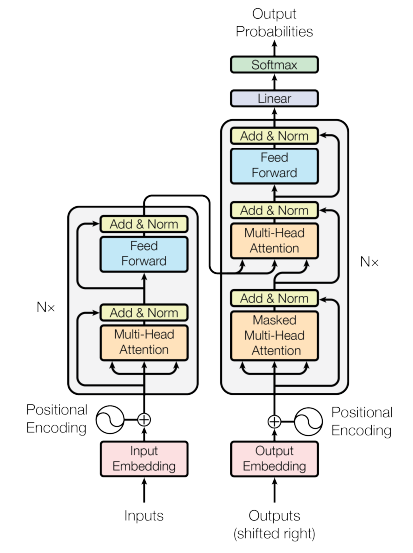

# Transformer
This repository implements the Transformer architecture given in the "Attention is All You Need" [1] paper for study and practice purposes.

<p align="center">

</p>

## Usage
If you want to train and test the implementation, you can follow the next steps 

Clone the repo

```
git clone https://github.com/AzarUmudov/Transformer.git
```

Download necessary libraries 
```
pip install datasets
pip install tokenizers
pip install torchmetrics
```

Run the training step
```
from train import train
from config import get_config
cfg = get_config(seq_len=400)
cfg['model_folder'] = '../weights'
cfg['tokenizer_file'] = '../vocab/tokenizer_{0}.json'
cfg['batch_size'] = 8
cfg['num_epochs'] = 20
train(cfg)
```

If you want to run the code in Colab, run the following step

Clone the repo
```
!git clone https://github.com/AzarUmudov/Transformer.git
```
Download necessary libraries
```
!pip install datasets
!pip install tokenizers
!pip install torchmetrics
```

Create directories for saving models and tokenizers
```
from google.colab import drive
drive.mount('/content/drive')

%cd /content/Transformer/
!mkdir -p /content/drive/MyDrive/Models/Transformer/weights
!mkdir -p /content/drive/MyDrive/Models/Transformer/vocab
```
Run the training step 
```
from train import train
from config import get_config
cfg = get_config(seq_len=400)
cfg['model_folder'] = '..//drive/MyDrive/Models/Transformer/weights'
cfg['tokenizer_file'] = '..//drive/MyDrive/Models/Transformer/vocab/tokenizer_{0}.json'
cfg['batch_size'] = 8
cfg['num_epochs'] = 20
train(cfg)
```

## Dataset

For dataset, I used the opus books [2] dataset from HuggingFace for translation from English to German. But you can use other datasets, just changing dataset infos in config.py 


## To Do
Currently, the decoder picks the next token based on a greedy search
- Add a beam search  

## References
[1] https://arxiv.org/abs/1706.03762 \
[2] https://huggingface.co/datasets/opus_books